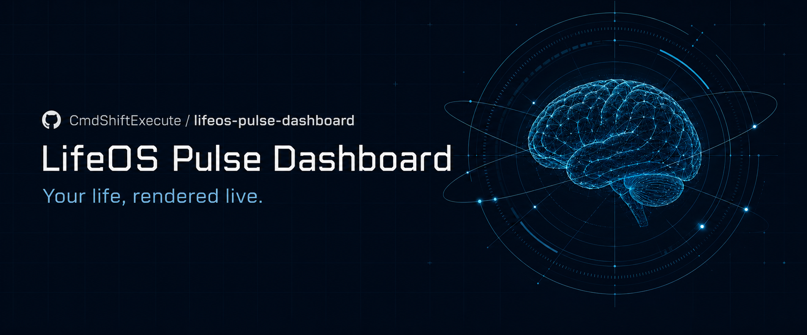
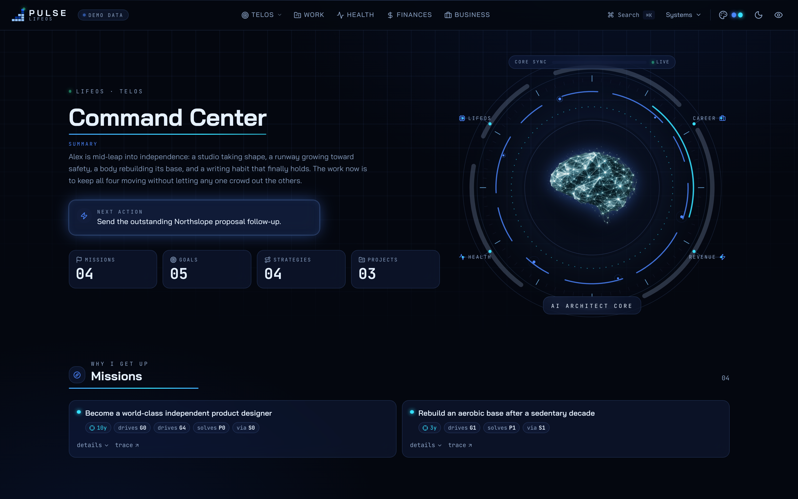
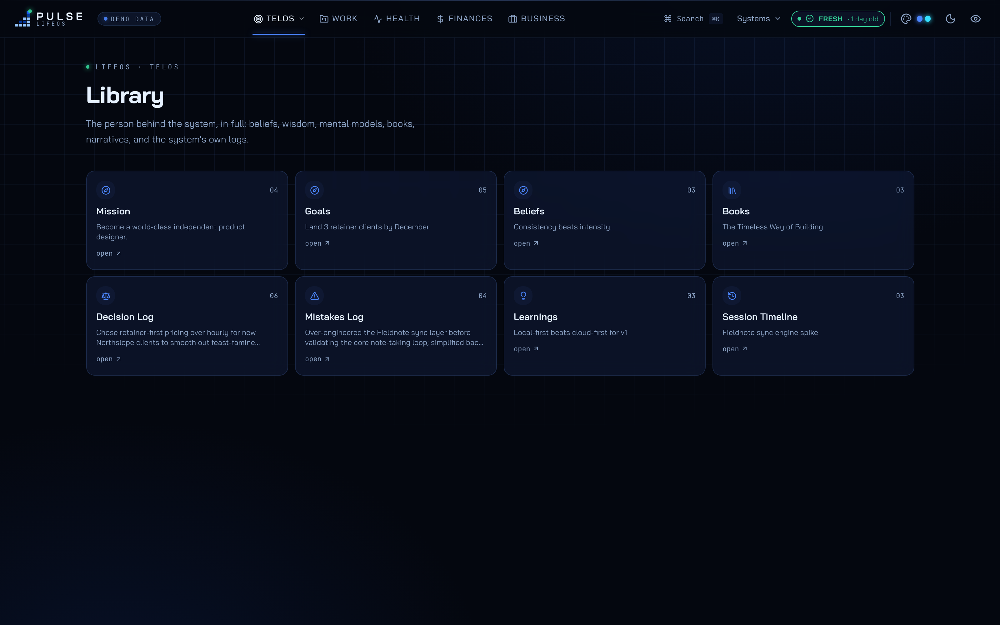
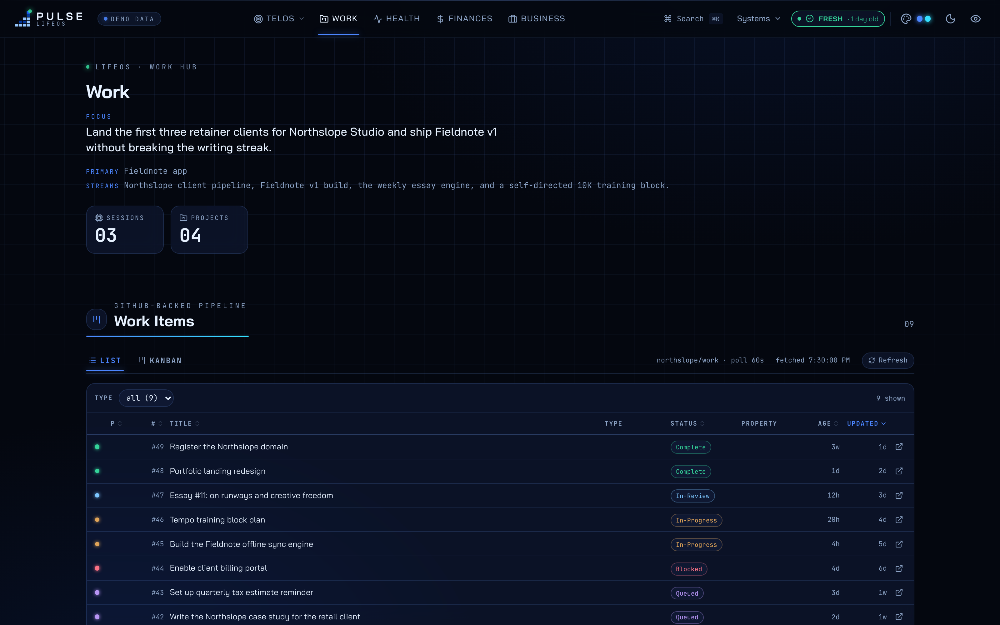
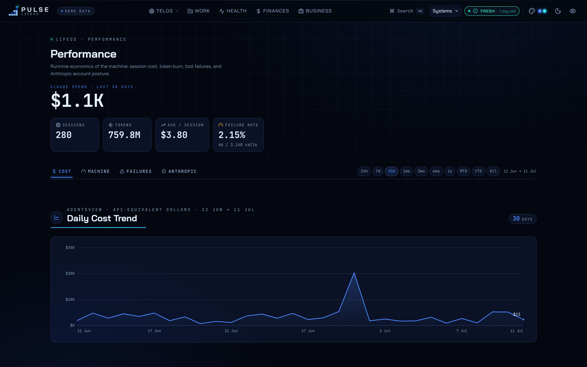
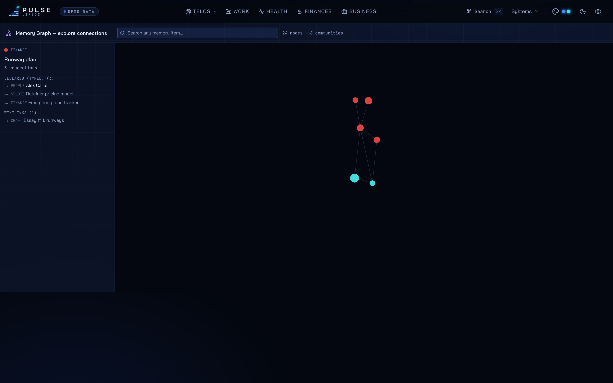
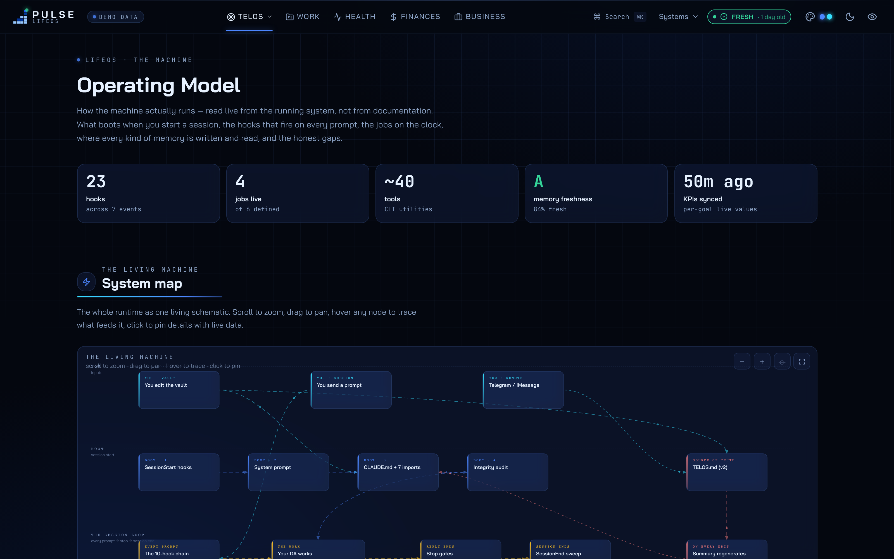

<div align="center">



# LifeOS Pulse Dashboard

A polished frontend for your [LifeOS](https://github.com/danielmiessler/LifeOS) personal AI. It turns the files your assistant already writes (goals, work sessions, memory, cost logs) into a fast, themeable command center you actually want to open.

[](LICENSE)


[Quick start](#quick-start) · [Setup](docs/SETUP.md) · [API contract](docs/API.md) · [Prompting guide](docs/PROMPTING-GUIDE.md) · [Architecture](docs/ARCHITECTURE.md)

[](https://vercel.com/new/clone?repository-url=https%3A%2F%2Fgithub.com%2FCmdShiftExecute%2Flifeos-pulse-dashboard)

</div>

---

## What this is

LifeOS Pulse Dashboard is an independent, enhanced dashboard frontend for the [LifeOS](https://github.com/danielmiessler/LifeOS) ecosystem (Daniel Miessler's open-source personal AI framework, previously named PAI, "Personal AI Infrastructure"). LifeOS runs as an agentic harness on your machine and continuously writes structured files about your life and your assistant's work. This project reads those signals over a small HTTP API and renders them as a coherent, real-time interface: dimension rings for life balance, a goals system that traces missions down to daily strategies, a work kanban wired to your live sessions, a memory explorer, agent and cost observability, and a knowledge wiki with a link graph.

It is a **frontend only**. It does not run your assistant, store your data, or make decisions. The stock LifeOS Pulse server (or endpoints you implement yourself, see the [prompting guide](docs/PROMPTING-GUIDE.md)) provides the data; this project makes it legible. If you just want to see what it looks like, the demo mode runs with zero configuration and fictional data.

## Screenshots

| Life & TELOS overview | Goals system |
| :---: | :---: |
|  |  |

| Work kanban | Performance & cost |
| :---: | :---: |
|  |  |

| Memory explorer | Operating Model map |
| :---: | :---: |
|  |  |

## Feature tour

**Life overview.** A radial view of your life dimensions (craft, health, wealth, mind, and the rest), each ring driven by a percentage your assistant maintains. A one-sentence status, top goals, next actions, and a spark line pull from the same source, so the landing page answers "where am I right now" at a glance.

**TELOS goals system.** The heart of the dashboard. TELOS is the LifeOS convention for modeling a life as a dependency graph: missions to goals to problems to strategies, with KPIs attached. Pulse renders the full chain, flags "stranded" items (work with no goal, goals with no strategy, idle strategies), and gives every mission, belief, mental model, book, and narrative its own richly formatted library page.

**Work kanban.** Your live Algorithm sessions and your work-tracker issues in one board, grouped by phase or column, with effort tiers and source badges. Sessions stream in over SSE with a polling fallback, so the board moves as your assistant works.

**Memory explorer.** The decisions, mistakes, learnings, and session narratives your assistant logs, presented as browsable, dated ledgers. This is the human-readable side of the "memory ledger" convention documented in the [prompting guide](docs/PROMPTING-GUIDE.md).

**Agent & session observability.** Live event feeds, mode and phase timelines, an effort-distribution view, tool-failure leaderboards, and a set of insight panels over your assistant's activity. Useful for understanding what your agents are actually doing and where they stall.

**Performance & cost analytics.** Token and cost breakdowns by day, model, project, and agent, plus tool-failure analysis. The richest views here read from [agentsview](https://www.agentsview.io/), a local Claude-session viewer (see the [prerequisite note in setup](docs/SETUP.md#tier-c-agentsview-for-agent-analytics)).

**Knowledge wiki + graph.** Your documentation, skills, and hooks as a searchable wiki, with a D3 force graph over the wikilinks between notes. Separate graph views exist for knowledge, memory, and system internals.

**Operating Model map.** An interactive, self-describing map of the running system: what boots when, the per-prompt hook chain, scheduled jobs, where memory is written and read, and the honest gaps. It is parsed live from your config, so it never drifts from reality.

**Themes & command palette.** Six cohesive palettes (five dark, one light), switchable instantly, with a keyboard command palette for jumping to any surface.

## Quick start

Requires [Bun](https://bun.sh). Node 18+ also works if you swap `bun` for `npm`.

```bash
git clone https://github.com/CmdShiftExecute/lifeos-pulse-dashboard.git
cd lifeos-pulse-dashboard
bun install

# Demo mode: instant, zero config, fictional data
bun run demo
```

Open [http://localhost:3333](http://localhost:3333). Demo mode serves a self-contained fictional persona (no backend required), so you can click through every surface immediately.

Prefer a hosted demo? The **Deploy with Vercel** button above ships the same fictional-data demo to your own Vercel account in about a minute (`vercel.json` bakes in demo mode; remove it or unset `NEXT_PUBLIC_DEMO_MODE` when you self-host against real data).

When you are ready to see your own life in it, follow **[docs/SETUP.md](docs/SETUP.md)** to point the dashboard at your LifeOS install.

## Architecture in one breath

Next.js App Router, one page per surface, one typed React Query / polling hook per surface, and a single tiny API helper (`src/lib/local-api.ts`) that fetches same-origin relative paths. In production the LifeOS Pulse server hosts the API on the same origin as the dashboard, so no CORS and no config. Theming is a pure CSS-variable layer with `[data-theme]` on the root element. Full detail in **[docs/ARCHITECTURE.md](docs/ARCHITECTURE.md)**; the endpoint contract is in **[docs/API.md](docs/API.md)**.

## Documentation

- **[docs/SETUP.md](docs/SETUP.md)**, demo mode, connecting to a real LifeOS install, and the agentsview prerequisite.
- **[docs/API.md](docs/API.md)**, every endpoint the frontend consumes, with response shapes.
- **[docs/PROMPTING-GUIDE.md](docs/PROMPTING-GUIDE.md)**, copy-paste prompts to make the dashboard render your own data, plus the memory-ledger and TELOS conventions it visualizes.
- **[docs/ARCHITECTURE.md](docs/ARCHITECTURE.md)**, frontend structure, data flow, theming, and how to add a surface.
- **[CONTRIBUTING.md](CONTRIBUTING.md)**, how to contribute.

## Scope, honestly

This repo is the view layer. It is an enhanced take on the stock Pulse dashboard concept from LifeOS, with a significantly refined frontend, but it depends on a backend to be interesting. That backend is either the LifeOS Pulse server or a set of endpoints you implement (the prompting guide walks you through it). Nothing here writes to your life files; the dashboard reads, and a couple of narrow routes (bookmark toggles, loop controls) post back to your own server if it supports them.

## Credits

- **[Daniel Miessler](https://github.com/danielmiessler)** for [LifeOS / PAI](https://github.com/danielmiessler/LifeOS), the personal-AI framework this dashboard is built to visualize. The TELOS, memory, and Algorithm conventions are his.
- **[agentsview](https://www.agentsview.io/)** for the local session data that powers the performance and cost analytics.
- **[Bai Jamjuree](https://fonts.google.com/specimen/Bai+Jamjuree)** and **[JetBrains Mono](https://www.jetbrains.com/lp/mono/)**, both under the SIL Open Font License, for the typefaces.

Built by [Shashank Sharma](https://github.com/CmdShiftExecute).

## License

[MIT](LICENSE) © 2026 Shashank Sharma.
